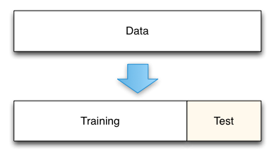
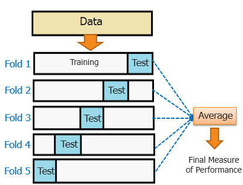

# Vocal Recognizer
---
In this project we used a Machine Learning model, the SVC, from Scikit-learn library for python.
We fixed a goal: recognize if a voice is from "person A" or "person B". We tried with our own voices, but the results were unsatisfying and very low.

Below there're the modules we use.
### Modules used
```python
# Import modules

#         Pandas, Matplotlib, Numpy - Filtering, Plotting, 


import pandas as pd
import matplotlib.pyplot as plt
import numpy as np
%matplotlib inline

#         SciKit Learn - Proprocessing, AI model, split for train&test and cross validate

from sklearn.preprocessing import StandardScaler 
from sklearn.svm import SVC
from sklearn.model_selection import train_test_split
from sklearn.model_selection import cross_validate

#         SciPy - Import and export .wav files, Gaussian Filter, Spectrogram

from scipy.io import wavfile # Import wav files
from scipy.ndimage import gaussian_filter
from scipy import signal
```
---
## Extract data from YouTube's videos
First of all, we thought about what kind of datas we could elaborate, and we chose audio files. We search on YouTube "audio book 20 mins" and we chose these two videos / audio books:

* [The 80/20 principle](https://www.youtube.com/watch?v=zKtdVseMNAM)
* [A bedtime story for children](https://www.youtube.com/watch?v=6nA_Je_8i-U&t=1168s)

Then we imported them on python with:
```python
from scipy.io import wavfile

frequence, file = wavfile.read("file_path/file_name.wav")
```
This function returns file's frequence, points in one second, and an array with all the points in the audio.


---
## Data preparation
With more than 20 minutes of videos with had more than 52 milion of points (in the array). Due this very huge number, and the need to have the same length for both videos, we reduced them untill we reached 20 minutes. To do this we calculate how many points there were in one second by the frequency, or rather 44100 Hz, then we multiply this number for 20x60 (that is 20 minutes in seconds).

```python
# Import files
freq_8020, audio_8020 = wavfile.read(f"{root}8020.wav")
freq_BT, audio_BT = wavfile.read(f"{root}BT.wav")

# Remove music from the begin and end of audios
audio_8020 = audio_8020[15*freq_8020:]
audio_BT = audio_BT[16*freq_BT:(22*60+34)*freq_BT]

# Make equal length for both videos
diff = audio_8020.size - 20*60*freq_8020
a_8020 = audio_8020[diff:]
diff = audio_BT.size - 20*60*freq_BT
a_BT = audio_BT[diff:]
```

After we cut some music there was at the beginning of both videos and we get two array that were made up of 15 and 16 minutes.

Here's the plot of a portion of the audios.


We also needed to fit and transform audios to have a resonabe and real score from the SVC. We use reshape because we were working on an array.
```python
a_8020 = scaler.fit_transform(a_8020.reshape(-1, 1)).flatten()
a_BT = scaler.fit_transform(a_BT.reshape(-1, 1)).flatten()
```
The plot:


After that, we decide to apply a mask for the tracks to extract usefull datas. This mask were created by subtract the mean of all the points of the arrays to theirselves. Next we apply the absolute value to the arrays to move the plot up to the zero. We needed also to reduce the rumor to understand where there's silence and where there isn't, so we used the Gaussian filter, and there's the result (only the Gaussian):

```python
copy_8020 = gaussian_filter(np.abs(a_8020 - np.mean(a_8020)), 100)
copy_BT = gaussian_filter(np.abs(a_BT - np.mean(a_BT)), 100)
```


And here there's the mask:

```python
mask8020 = copy_8020 > silence
maskBT = copy_BT > silence
```


__Attention! In these graphs there is some offset between plots for visualization purpose.__

After we applied the mask, we had to cut where, in the audios, there was silence, and reconnect the cutted tracks. To do this we use numpy's where and where the condition weren't satisfy we put None, after, to remove the Nones, we transformed the array into a pandas series and used pandas's dropna. Then we re-transformed all into an a numpy array.
```python
a_X = pd.Series(np.where(((filt_a>silence)) == 1, batch_a, None))
b_X = pd.Series(np.where((filt_b>silence) == 1, batch_b, None))
  
a_X.dropna(axis=0, inplace=True)
b_X.dropna(axis=0, inplace=True)
  
a_X = a_X.as_matrix()
b_X = b_X.as_matrix()

array_a = np.asarray(a_X, dtype=np.int16)
array_b = np.asarray(b_X, dtype=np.int16)
```
Next we needed to check which frequencies were used, but first we had to divide the files into batches. At beginning we fixed a length that could be divisible without carry-overs, and we lost some information at the end of the array.
```python
batch_a_final = array_a[:-(len(array_a)%batch_size)]
batch_b_final = array_b[:-(len(array_b)%batch_size)]
```
Later we set the number of batches, by dividing the length of the previous array by the size of the single batches.
```python
len_batch_a = int(len(batch_a_final) / batch_size)
len_batch_b = int(len(batch_b_final) / batch_size)
```
Below we reshaped the arrays into matrices ``batch_size * row``, we'll define what are rows a bit later. 
```python
batch_a = batch_a_final.reshape(-1, batch_size, order="C")
batch_b = batch_b_final.reshape(-1, batch_size, order="C")
```
Here's we initialized two array composed by zeros, and did a ``for`` that filled our matrices' row with useful data by call the function ``reduce_batch()``.
```python
batch_a_f = np.zeros([len_batch_a, frequence])
for i in range(len_batch_a):
    batch_a_f[i, :] = reduce_batch(batch_a[i, :], fs, frequence)
    
batch_b_f = np.zeros([len_batch_b, frequence])
for i in range(len_batch_b):
    batch_b_f[i, :] = reduce_batch(batch_b[i, :], fs, frequence)
```
What's inside ``reduce_bacth()``? This:
```python
def reduce_batch(batch, fs, cut_freq):
    freqs, time, spectr = signal.spectrogram(batch, fs)
    freqs = freqs[:cut_freq]
    spectr = spectr[:cut_freq, :]
    mean_array = np.mean(spectr, 1)
    return mean_array
```
In this function there is a spectrogram that helped us to understand which ferequencies were actually used and heard, and to cut the ones that we heard and use. It returns the mean of the intensity of frequencies at a particular instat of time.

For some graphical issues we weren't able to plot labels for axis, but I explain what they are. Below all the plots, in order:
* Full spectrogram (batch)
* Cutted spectrogram (batch)
* Batch


In spectrograms on axis Y there are all the frequencies, on axis X there is the time, and more lighter color become, more intense is the frequency.

On batches plots on axis Y there's the mean of the frequencies of spectrogram, and on axis X, which frequency they refer to.

---
# Machine Learning Model
All those instructions were did to return a X and an y for the SVM, or *Support Vector Machine*. But what's a SVM?

## SVM

__*Support Vector Machines*__ are supervised learning models used for classification and regression purpose. Given a dataset divided into two classes, or more, it assign new example to one or other category. All these examples and datasets are represented as points in a space, after it makes to divide as possible as it can, these points. This space is divide by a plane, 2 dimension or more dimension, and the nearest points are called __*Support Vector*__. Those points depends on dataset and if they're moved or deleted, the plane changes. 


Doing like this is possible to clarify if a new example is belonging to a category instead of an other.

---

# Train & Test, Hyperparameters

First we tried to apply the classic train and test method from SciKit-Learn, but it returned not very high score, so we tried with cross validation.

Before explain what's cross validation, I think is could be useful to understand what's
the "classic" train and test.

The "classic" method consist of dataset splitting in two areas: train and test area.
Train area is obviously bigger than test beacuse the Machine Learning model needs to train on dataset, and the score is bigger also due the quantity of data. Test is a small a part of the dataset and return a score more real-like.



Here we are, now what's cross validation? Cross validation is very similar to "classic" method. It split the dataset more times, and change the position of test and train. The function, from sklearn, return a dictionary that contain the mean of test and train's score.



After that we found what we thought it could be the maximum result, then we tried to modify some *hyperparameters*, *silence thresholds* and *frequency thresholds*. We tried with a matrix that combined all the hyperparameters of SVM and another matrix that combined the thresholds.

We did this with two functions. __Spoiler alert__ : the second fucntion were useless because we have modified these parameters by eye looking at the plots.

In this function we pass X and y from the audios, after we have defined the lapse of C and gamma in logaritm way, and a list where we have saved the results.

```python
def train_c (X, y):
  
    scores = [[] for x in range(5)]
    lapse_c = np.logspace(4, 8, 5)
    lapse_g = np.logspace(-5, 1, 5)
```

Next we did ``for`` loop and we combined C and gamma and we saved the scores, to check at what point of the loop we were, we call a progress bar function from Andrea Amico's website.

```python
    for ic, c in enumerate(lapse_c):
        for ig, g in enumerate(lapse_g):
            svc_temp = SVC(C=c, gamma=g)
            scores[ig].append(cross_validate(svc_temp, X, y, cv=5, return_train_score = True))
        progress_bar(ic*len(lapse_g)+ig, len(lapse_c)*len(lapse_g))
```

At end we returned the lists that contained both lapse and the score.

```python
    return scores, lapse_c, lapse_g
```
---
# Results

After all we had to understand how big a batch had to be, so we do a function called ``graph`` that throught a ``for`` and some slices returned to us this plot:


``Accuracy on train : 98% +/- 0.1%``

``Accuracy on test : 89% +/- 1%``

We can undestand that more batch there are more accurate is the model.

__This project was made by Staropoli Amos and Bartolini Lorenzo from ISIS Gobetti-Volta in Bagno a Ripoli (Florence).__